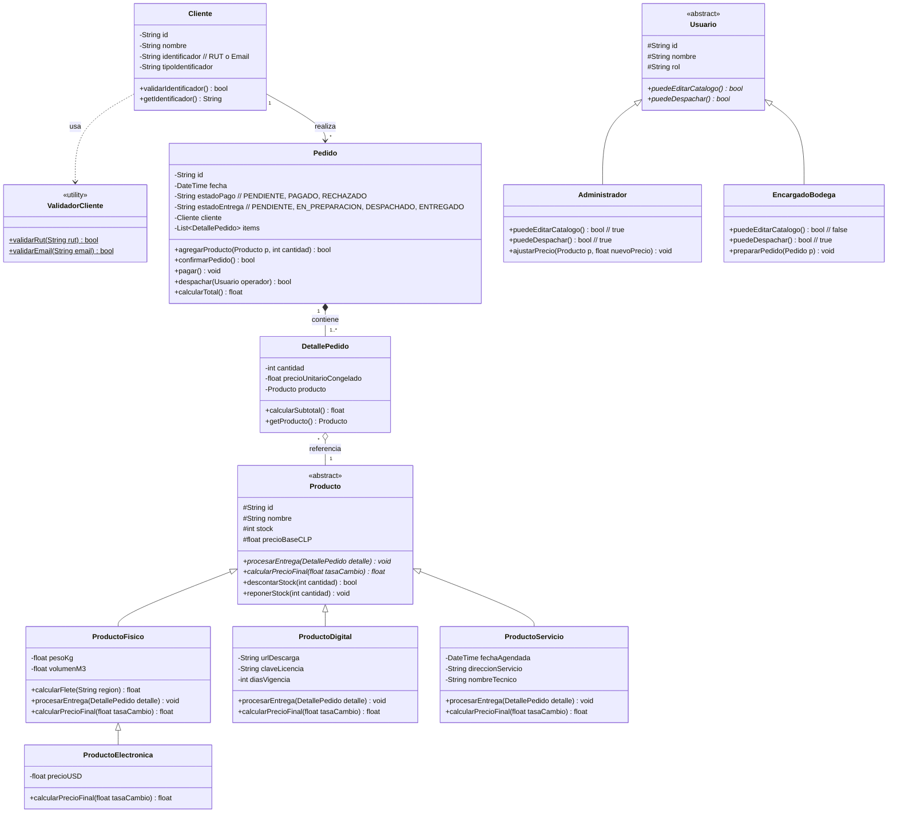

# 🛒 ClickAndGo - Plataforma E-Commerce (POO + Web + Base de Datos)

Proyecto evaluado para la asignatura de **Programación Orientada a Objetos (POO)**.  
Plataforma e-commerce **ClickAndGo** con entrega polimórfica según tipo de producto, control de acceso basado en roles (RBAC), validación de clientes en Chile (RUT y Email), conversión de divisas para productos importados y persistencia en Base de Datos.

---

## 📌 1. Ficha del Proyecto
- **Institución:** INACAP
- **Carrera:** Analista Programador
- **Asignatura:** Programación Orientada a Objetos (Código: TI3V21 — PRIMAVERA 2026)
- **Sección:** 114-2A-F2
- **Caso Asignado:** 05: Tienda de e-commerce (**ClickAndGo**)
- **Integrantes del Equipo:**
  1. Miguel Troncoso
  2. Alexandy Remicinthe
- **Docente a Cargo:** Michael Alexis Arjel Mayerovich
- **Repositorio Remoto:** [github.com/MiguelTroncoso/ecommerce](https://github.com/MiguelTroncoso/ecommerce)
- **Documento PDF Oficial de Entrega:** [`docs/ES1_114-2A-F2_ecommerce.pdf`](./docs/ES1_114-2A-F2_ecommerce.pdf)
- **Diagrama Editable:** [`docs/diagrama_clases.drawio`](./docs/diagrama_clases.drawio)
- **Imagen del Diagrama:** [`docs/diagrama_clases.png`](./docs/diagrama_clases.png)
- **Informe Completo:** [`docs/informe_solucion.md`](./docs/informe_solucion.md)

---

## 🎯 2. Caso de Negocio: ClickAndGo

ClickAndGo comercializa productos con diferentes tipos de entrega:
1. **Físicos:** Despacho tradicional por transporte terrestre; cálculo dinámico de flete.
2. **Digitales:** Licencias de software y e-books; entrega inmediata vía link de descarga sin flete.
3. **Servicios:** Instalaciones a domicilio y soporte; agendamiento para fecha y hora futura.
4. **Electrónica (Importados):** Productos físicos cotizados en USD con conversión a CLP según tipo de cambio diario.

### Roles Operativos
- **Encargado de Bodega:** Prepara y despacha pedidos. **Regla estricta:** NO puede modificar precios ni editar el catálogo.
- **Administrador:** Control total de catálogo (CRUD) y modificación de precios.

### Reglas de Integridad
- **Validación de Clientes:** RUT chileno (algoritmo Módulo 11) o Email válido antes de aceptar pedidos.
- **Multi-línea:** Un pedido agrupa múltiples productos con sus cantidades y precios congelados.
- **Control de Stock:** No se confirma el pedido si falta stock de algún producto.
- **Bloqueo de Despacho:** Un pedido no puede marcarse como despachado si aún no está pagado.

---

## 🧠 3. Justificación Teórica de POO (Defensa de Examen / Evaluación)

Cuando el docente evalúe el proyecto, estas son las justificaciones técnicas implementadas en el diseño:

| Pilar POO | Aplicación en ClickAndGo | Beneficio de Diseño |
| :--- | :--- | :--- |
| **Abstracción** | Clase base abstracta `Producto` que define el contrato común (`id`, `nombre`, `stock`, `procesarEntrega()`, `calcularPrecioFinal()`). | Desacopla la lógica general de las peculiaridades de cada producto. |
| **Herencia** | `ProductoFisico`, `ProductoDigital` y `ProductoServicio` heredan de `Producto`. `ProductoElectronica` hereda de `ProductoFisico`. | Reutilización de código y jerarquías semánticas claras. |
| **Polimorfismo** | El método `procesarEntrega()` se implementa distinto según el producto: envío de link, cálculo de flete o agenda de servicio. | El `Pedido` procesa la entrega sin conocer la clase concreta (Principio Open/Closed). |
| **Encapsulamiento** | Atributos privados con métodos de acceso y reglas de negocio encapsuladas (ej. `despachar()` valida el pago internamente). | Protege la integridad del estado del objeto y previene inconsistencias. |
| **Composición** | `Pedido` se compone de `DetallePedido` (`1` a `1..*`). Si el pedido se destruye, sus líneas de detalle no tienen razón de existir. | Relación de ciclo de vida fuerte (Composición UML `◆`). |
| **Agregación** | `DetallePedido` referencia a `Producto` (`*` a `1`). Si se borra un detalle, el producto sigue existiendo en el catálogo. | Relación de ciclo de vida independiente (Agregación UML `◇`). |

---

## 📐 4. Diagrama de Clases UML (draw.io)

El archivo editable para importar en draw.io se encuentra en:
👉 [`docs/diagrama_clases.drawio`](./docs/diagrama_clases.drawio)

### Vista Rápida en Mermaid:



---

## 💻 5. Arquitectura del Sistema (Front + POO + Base de Datos)

```
┌────────────────────────────────────────────────────────┐
│          FRONTEND (Bootstrap + HTML5 + CSS + JS)       │
│  - Catálogo interactivo (Filtros, badges según tipo)   │
│  - Carrito de compras y cálculo reactivo               │
│  - Formulario de Checkout con validación RUT / Email   │
│  - Vistas de Bodega (Despacho) y Admin (Catálogo)      │
└───────────────────────────┬────────────────────────────┘
                            │ API / Eventos
┌───────────────────────────▼────────────────────────────┐
│                  CAPA DE DOMINIO POO                   │
│  - Clases de Producto (Polimorfismo de entrega)        │
│  - Lógica de Pedidos, cálculo de flete y stock         │
│  - Manejador de Divisas (USD -> CLP para electrónica)  │
│  - Control de Acceso (Bodega vs Administrador)         │
└───────────────────────────┬────────────────────────────┘
                            │ ORM / Data Mapper / SQL
┌───────────────────────────▼────────────────────────────┐
│                    BASE DE DATOS                       │
│  - Tablas: clientes, usuarios, productos, pedidos,     │
│    detalles_pedido, despachos                          │
└────────────────────────────────────────────────────────┘
```

---

## 🚀 6. Cómo Abrir el Diagrama en draw.io
1. Ingresa a [app.diagrams.net](https://app.diagrams.net/)
2. Haz clic en **Abrir diagrama existente** (Open Existing Diagram).
3. Selecciona el archivo [`docs/diagrama_clases.drawio`](./docs/diagrama_clases.drawio) de esta carpeta.
4. Podrás editar colores, mover clases o exportar a imagen PNG/PDF para adjuntarlo a tu informe del Ambiente de Aprendizaje.
