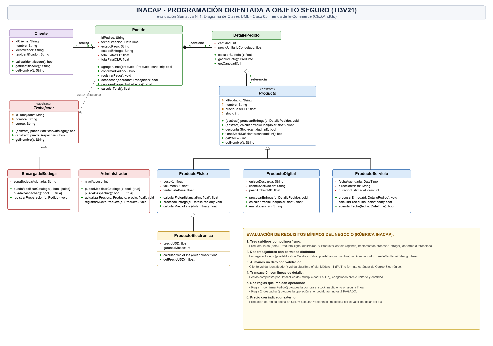
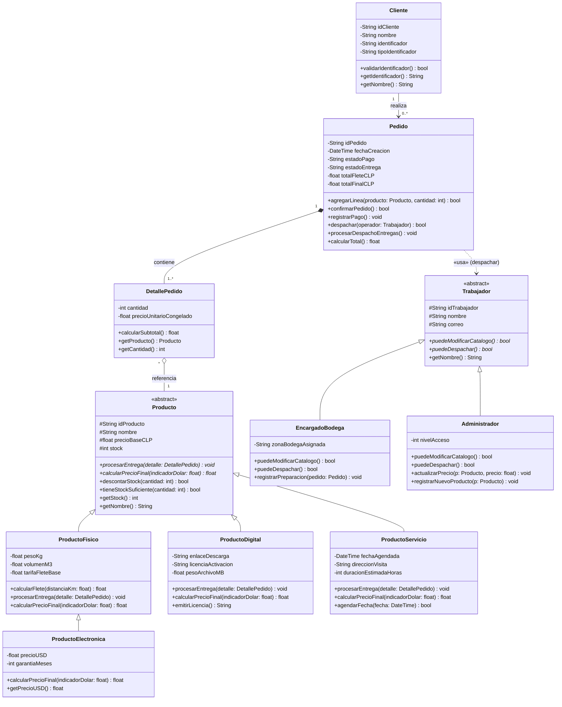

# 🛒 ClickAndGo - Plataforma E-Commerce (Modelado POO y UML)

[](https://www.inacap.cl/)
[](https://app.diagrams.net/)
[](https://es.wikipedia.org/wiki/Programaci%C3%B3n_orientada_a_objetos)
[]()

Proyecto evaluado para la asignatura de **Programación Orientada a Objetos (POO)** en INACAP.  
Plataforma e-commerce **ClickAndGo** diseñada con entrega polimórfica según tipo de producto, control de acceso basado en roles (RBAC), validación de clientes en Chile (RUT Módulo 11 y Email), transacciones multi-línea, reglas de negocio de integridad y conversión de divisas para productos importados.

---

## 📌 1. Ficha del Proyecto
- **Institución:** Instituto Profesional INACAP
- **Carrera:** Analista Programador
- **Asignatura:** Programación Orientada a Objetos (Código: TI3V21 — PRIMAVERA 2026)
- **Sección:** 114-2A-F2
- **Caso Asignado:** 05: Tienda de e-commerce (**ClickAndGo**)
- **Integrantes del Equipo:**
  1. **Miguel Troncoso**
  2. **Alexandy Remicinthe**
- **Docente a Cargo:** Michael Alexis Arjel Mayerovich
- **Fecha y Hora de Entrega:** Lunes 7 de septiembre de 2026, 20:30 horas
- **Nombre de Archivo Oficial:** `ES1_114-2A-F2_ecommerce.pdf`
- **Plataforma de Entrega:** Ambiente de Aprendizaje INACAP (AAI)
- **Documento PDF Oficial de Entrega:** [`docs/ES1_114-2A-F2_ecommerce.pdf`](./docs/ES1_114-2A-F2_ecommerce.pdf)
- **Diagrama Editable (draw.io):** [`docs/diagrama_clases.drawio`](./docs/diagrama_clases.drawio)
- **Imagen del Diagrama:** [`docs/diagrama_clases.png`](./docs/diagrama_clases.png)
- **Informe Técnico Completo:** [`docs/informe_solucion.md`](./docs/informe_solucion.md)

---

## 🎯 2. Caso de Negocio: ClickAndGo

ClickAndGo comercializa productos bajo tres mecánicas de entrega diferenciadas en un mismo pedido:
1. **Físicos:** Despacho tradicional por transporte terrestre; cálculo dinámico de flete en función del peso y volumen.
2. **Digitales:** Licencias de software y e-books; entrega inmediata vía enlace seguro de descarga sin costo de transporte ($0 flete).
3. **Servicios:** Instalaciones a domicilio y soporte técnico; agendamiento para fecha y hora futura con técnico asignado.
4. **Electrónica (Importados):** Productos físicos cotizados en USD con conversión a CLP según tipo de cambio diario (indicador externo).

### Roles Operativos (RBAC)
- **Encargado de Bodega:** Prepara y despacha pedidos (`puedeDespachar() == true`). **Regla estricta:** Tiene prohibido por diseño modificar precios o alterar el catálogo (`puedeModificarCatalogo() == false`).
- **Administrador:** Control total de catálogo (`puedeModificarCatalogo() == true`) y autorización de despacho (`puedeDespachar() == true`).

### Reglas de Integridad y Validación
- **Validación de Clientes:** RUT chileno (algoritmo Módulo 11) o Email sintáctico válido antes de procesar pedidos.
- **Transacción Multi-línea:** Un pedido agrupa múltiples líneas de detalle (`DetallePedido`), congelando cantidad y precio unitario pactado al momento de la compra.
- **Control de Stock:** Se bloquea la confirmación de la orden si el stock es insuficiente en cualquiera de las líneas.
- **Bloqueo de Despacho:** Un pedido no puede ser despachado si su estado de pago no es `PAGADO` o si el operador carece de permisos.

---

## 📊 3. Matriz de Cumplimiento de los 6 Requisitos de la Rúbrica INACAP

| # | Requisito de la Ficha | Clases y Miembros Responsables | Demostración de Cumplimiento |
| :-: | :--- | :--- | :--- |
| **1** | **Tres subtipos con polimorfismo** | `ProductoFisico`<br>`ProductoDigital`<br>`ProductoServicio` | Implementan `procesarEntrega()` de forma polimórfica: flete logístico, emisión de link/licencia o agendamiento técnico. |
| **2** | **Dos trabajadores con permisos distintos** | `EncargadoBodega`<br>`Administrador` | `EncargadoBodega` solo despacha (`puedeModificarCatalogo = false`); `Administrador` gestiona precios y catálogo (`puedeModificarCatalogo = true`). |
| **3** | **Al menos un dato con validación obligatoria** | `Cliente.validarIdentificador()` | Valida algoritmo Módulo 11 (RUT chileno) o formato de correo electrónico antes de aceptar cualquier orden. |
| **4** | **Transacción con líneas de detalle** | `Pedido` [Composición] `DetallePedido` | Relación multi-línea (`1` a `1..*`), congelando cantidad y precio unitario pactado al momento de la transacción. |
| **5** | **Dos reglas que impidan una operación** | • `confirmarPedido()`<br>• `despachar(operador)` | • **Regla 1:** Bloquea confirmación si no hay stock suficiente.<br>• **Regla 2:** Bloquea despacho si el pedido no está PAGADO o si el operador no tiene permisos. |
| **6** | **Precio dependiente de indicador externo** | `ProductoElectronica.calcularPrecioFinal()` | Cotiza el costo base en USD y lo convierte a pesos chilenos multiplicando por el valor del dólar del día. |

---

## 🧠 4. Justificación Teórica de POO

| Pilar POO | Aplicación en ClickAndGo | Beneficio de Diseño |
| :--- | :--- | :--- |
| **Abstracción** | Clase base abstracta `Producto` (`idProducto`, `nombre`, `precioBaseCLP`, `stock`, `procesarEntrega()`, `calcularPrecioFinal()`). | Desacopla las operaciones generales del catálogo de las peculiaridades de cada producto. |
| **Herencia** | `ProductoFisico`, `ProductoDigital` y `ProductoServicio` especializan `Producto`. `ProductoElectronica` especializa `ProductoFisico`. `EncargadoBodega` y `Administrador` especializan `Trabajador`. | Reutilización de código y jerarquías semánticas claras evitando duplicación. |
| **Polimorfismo** | El método `procesarEntrega()` resuelve dinámicamente según el producto: flete courier, clave/link o agenda técnica. | El `Pedido` procesa entregas sin acoplarse a clases concretas (Principio Abierto/Cerrado). |
| **Encapsulamiento** | Atributos privados (`-`) y protegidos (`#`) con validaciones de invariantes de negocio (stock, pagos y permisos). | Protege el estado interno del sistema previniendo mutaciones inconsistentes. |
| **Composición** | `Pedido` se compone de `DetallePedido` (`1` a `1..*`). Si el pedido se destruye, sus líneas de detalle se destruyen con él. | Relación de ciclo de vida fuerte (Composición UML `◆`). |
| **Agregación** | `DetallePedido` referencia a `Producto` (`*` a `1`). Si se elimina el detalle, el producto continúa intacto en inventario. | Relación de ciclo de vida independiente (Agregación UML `◇`). |

---

## 📐 5. Diagrama de Clases UML



> **Visualización Interactiva en Draw.io:**
> - 🌐 **Visor Web Directo:** [Abrir diagrama interactivo en app.diagrams.net (con zoom y navegación vectorial)](https://app.diagrams.net/#Uhttps%3A%2F%2Fraw.githubusercontent.com%2FMiguelTroncoso%2Fecommerce%2Fmain%2Fdocs%2Fdiagrama_clases.drawio)
> - 📁 **Archivo editable en el repositorio:** [`docs/diagrama_clases.drawio`](docs/diagrama_clases.drawio)

### Representación Estructural en Mermaid:



---

## 📂 6. Estructura de Entregables del Repositorio

```text
ecommerce/
├── README.md                          # Presentación y resumen de auditoría
├── docs/
│   ├── ES1_114-2A-F2_ecommerce.pdf    # PDF oficial para entrega en AAI INACAP
│   ├── informe_solucion.md            # Informe técnico en Markdown
│   ├── diagrama_clases.drawio         # Archivo vectorial editable en draw.io
│   └── diagrama_clases.png            # Render de alta definición del diagrama UML
└── src/ (Opcional - Prototipo POO)    # Implementación demostrativa en Python
```

---

## 🚀 7. Instrucciones para Revisión y Descarga

1. **Documento PDF Oficial de Entrega:**
   Descargar directamente desde [`docs/ES1_114-2A-F2_ecommerce.pdf`](docs/ES1_114-2A-F2_ecommerce.pdf) para adjuntar en la plataforma **Ambiente de Aprendizaje INACAP (AAI)** antes de las 20:30 horas.
2. **Edición del Diagrama en draw.io:**
   - Ingresar a [app.diagrams.net](https://app.diagrams.net/).
   - Seleccionar **Abrir diagrama existente** y cargar [`docs/diagrama_clases.drawio`](docs/diagrama_clases.drawio).
